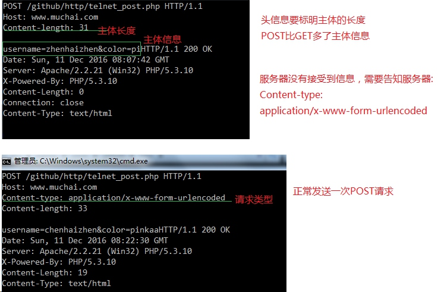

# HTTP协议介绍

重要性：
是使用`webservice`，还是`rest`做大型架构，都离不开对HTTP协议的认识

简化的说：
webservice = http协议 + XML
Rest = http协议 + JSON

各种API，也是通过http + XML/JSON来实现


做采集，需要对http协议有所了解，以及ajax，对http协议理解.


## 协议
计算机中的协议和现实中的协议是一样的，一式双份/多份
双方/多方都遵从共同的一个规范，这个规范称之为协议.

ftp, http, stmp, pop, tcp/ip 协议...


# http协议工作流程

当打开一个页面之后时.

0. 原始状态 : 客户端与服务器之间没有关系

1. request 请求

客户端 --> 服务器 (请求连接)
连接：就是网络上的`虚拟电路`

2. response 响应
 
客户端 <-- 服务器 (沿着连接，返回响应信息)
客户端，收到响应代码(HTML代码，解析文字，图片)

3. 断开连接


浏览器能发送HTTP协议，HTTP协议一定要浏览器来发送么?
不是，HTTP是一种协议，只要满足，什么工具都可以发送.
可以使用 `telnet host port` 
telnet作用：远程控制web服务器

回显功能:
`ctrl+]`输入之后，再回车

# HTTP请求信息 和 响应信息的格式


> 请求

1. 请求行
2. 请求头信息
3. 请求主体信息 (可以没有)
4. 头信息结束后和主体信息之间要空行一行

**请求行**
* 请求方法
	请求方法：GET，POST，PUT，HEAD，DELTE，TRACE，OPTIONS
* 请求路径
* 所用的协议: 目前一般是HTTP/1.1  0.9 和 1.0 基本不使用


使用telnet来完成HTTP协议的POST请求

```
POST /github/http/telnet_post.php HTTP/1.1
Host: www.muchai.com
Content-type: application/x-www-form-urlencoded
Content-length: 33
```


> 响应

1. 响应行
2. 相应头信息
3. 相应主体信息

**响应行**
* 协议 
* 状态码 
* 状态文字


# 方法与状态码

## 请求方法

> 请求方法有哪些?

GET, POST, HEAD, PUT, TRACE, DELETE, OPTIONS
HEAD和GET基本一致，只是不返回内容.
比如:只是确认一个内容(照片)是否还存在，不需要返回具体的内容。


PUT： 往服务器资源传输内容

TRACE：使用代理上网. 比如用代理访问`www.sf.gg`看下代理是否修改HTTP请求，可以使用TRACE来测试一下，`sf.gg`的服务器就会把最后收到的请求返回.
OPTIONS： 返回服务器可用的请求方法.

注意:这些请求方法虽然是HTTP协议中规定的，但WEB SERVER未必允许或支持这些方法.

## 状态码
状态码和状态文字

状态码： 是用来反应服务器响应情况的
最常见的: 200 OK, 404 NOT FOUND, 
状态文字是用来描述状态码，便于人观察

响应中的状态码

| 状态码        |   定义      |  说明                                |
| ----- | ----:	| :---- 			 |
| 1xx   |   信息             | 接收到请求，继续处理   |
| 2xx   |   成功             | 操作成功地收到请求，理解和接受 |
| 3xx   |   重定向         | 为了完成请求，必须采取进一步擦措施 |
| 4xx   |  客户端错误     | 请求的语法错误或不能完全被满足 |
| 5xx   |  服务端错误     | 服务器无法完成明显有效的请求 |

常用的状态码：
200 -- 服务器成功返回网页
301/2 --  永久/临时重定向  
```
<?php
header('Location: http://www.sf.gg'); // 默认是 302 重定向
header('Location: http://www.sf.gg', true, 301); // 301 重定向  // 永久重定向 ， true参数指的是用301头信息替换原来的头信息
?>
```
304 Not Modified --  未修改 （客户端告知服务器请求的资源，`时间`和 `ETag`是否变化） 
307 重定向中保持原有的请求数据.(POST重定向之后，数据丢失)

失败的状态码：
404 -- 请求的网页不存在
503 -- 服务器暂时不可用
500 -- 服务器内部错误


# socket编程发送GET请求


**telnet post**
```
POST /github/http/test.php HTTP/1.1
Host: www.muchai.com
Content-type: application/x-www-form-urlencoded
Content-length: 10
```

